**Remote-tracking branches** are references to the state of remote branches. They’re local references that you can’t move; Git moves them for you whenever you do any network communication, to make sure they accurately represent the state of the remote repository.

Remote-tracking branch names take the form `<remote>/<branch>`


Let’s say you have a Git server on your network at `git.ourcompany.com`. If you clone from this, Git’s `clone` command automatically names it `origin` for you, pulls down all its data, creates a pointer to where its `master` branch is, and names it `origin/master` locally. 

Git also gives you your own local `master` branch starting at the same place as origin’s `master` branch, so you have something to work from.

![[Pasted image 20260914213810.png]]

If you do some work on your local `master` branch, and, in the meantime, someone else pushes to `git.ourcompany.com` and updates its `master` branch, then your histories move forward differently. 

As long as you stay out of contact with your `origin` server, your `origin/master` pointer doesn’t move.

![[Pasted image 20260914214454.png]]

To synch, use `git fetch <remote>`

This fetches any data from `<remote>` that you don’t yet have, and updates your local database, moving your `origin/master` pointer to its new, more up-to-date position.

![[Pasted image 20260914214617.png]]

What does `git fetch` do, graph wise?

-> `git fetch <remote>` basically updates all the branches of type `<remote>/*` on your local repo.

-> `git fetch <remote> <branch>` only updates `remote/branch`.

So, `git fetch` updates the remote branches. It doesn't place the files in your directory, that doesn't make sense. Yes, your files would look different, but only if you were on a `<remote>` branch.

### Example with multiple remote servers

Assume you have another internal Git server that is used only for development by one of your sprint teams. This server is at `git.team1.ourcompany.com`. You can add it as a new remote reference to the project you’re currently working on by running the `git remote add` command.

![[Pasted image 20260914214814.png]]

`git fetch teamone`

Result:

![[Pasted image 20260914214933.png]]

This server has a subset of the data your `origin` server has right now, Git fetches no data but sets a remote-tracking branch called `teamone/master` to point to the commit that `teamone` has as its `master` branch.


### Pushing to remote - how it works

You have to explicitly push the branches you want to share. 

`git push <remote> <branch>` is the command.

```
$ git push origin serverfix
Counting objects: 24, done.
Delta compression using up to 8 threads.
Compressing objects: 100% (15/15), done.
Writing objects: 100% (24/24), 1.91 KiB | 0 bytes/s, done.
Total 24 (delta 2), reused 0 (delta 0)
To https://github.com/schacon/simplegit
 * [new branch]      serverfix -> serverfix
```

Git automatically expands the `serverfix` branchname out to `refs/heads/serverfix:refs/heads/serverfix`, which means, “Take my `serverfix` local branch and push it to update the remote’s `serverfix` branch.”

You can also do `git push origin serverfix:serverfix`, which does the same thing. 
It says, “Take my serverfix and make it the remote’s serverfix.” 

You can use this format to push a local branch into a remote branch that is named differently. If you didn’t want it to be called `serverfix` on the remote, you could instead run `git push origin serverfix:awesomebranch` to push your local `serverfix` branch to the `awesomebranch` branch on the remote project.

The next time one of your collaborators fetches from the server, they will get a reference to where the server’s version of `serverfix` is under the remote branch `origin/serverfix`:

```console
$ git fetch origin
remote: Counting objects: 7, done.
remote: Compressing objects: 100% (2/2), done.
remote: Total 3 (delta 0), reused 3 (delta 0)
Unpacking objects: 100% (3/3), done.
From https://github.com/schacon/simplegit
 * [new branch]      serverfix    -> origin/serverfix
```

**It’s important to note that when you do a fetch that brings down new remote-tracking branches, you don’t automatically have local, editable copies of them. In other words, in this case, you don’t have a new `serverfix` branch , you have only an `origin/serverfix` pointer that you can’t modify.**

If you want your own `serverfix` branch that you can work on, you can base it off your remote-tracking branch:

```console
$ git checkout -b serverfix origin/serverfix
Branch serverfix set up to track remote branch serverfix from origin.
Switched to a new branch 'serverfix'
```

This gives you a local branch that you can work on that starts where `origin/serverfix` is.

An example:

***Before a fetch:***

Local machine:
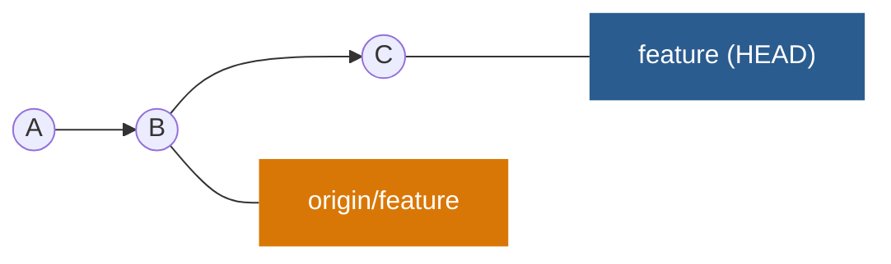

Remote machine:
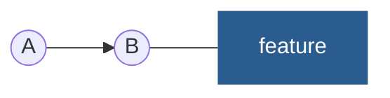

***After a fetch:***

Local machine:
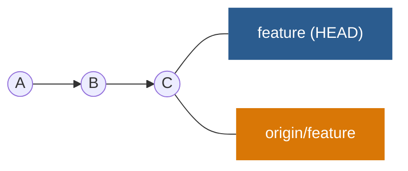

Remote:
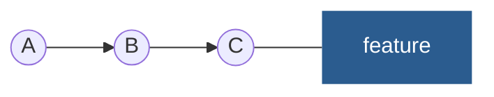


What happens is the branch is not there in the remote server?

Local:
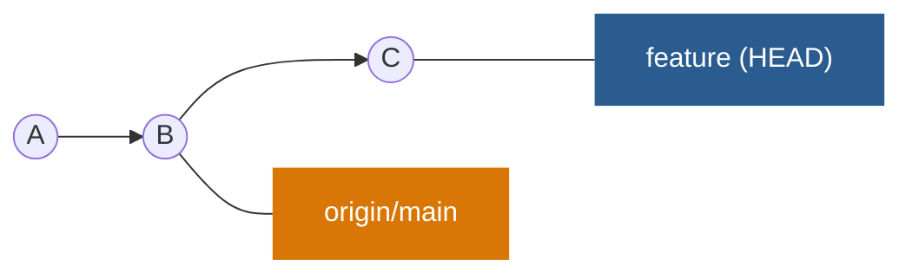

Remote:
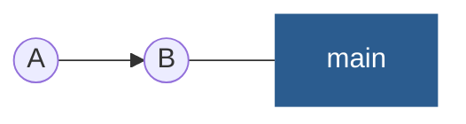

After pushing:

Local:
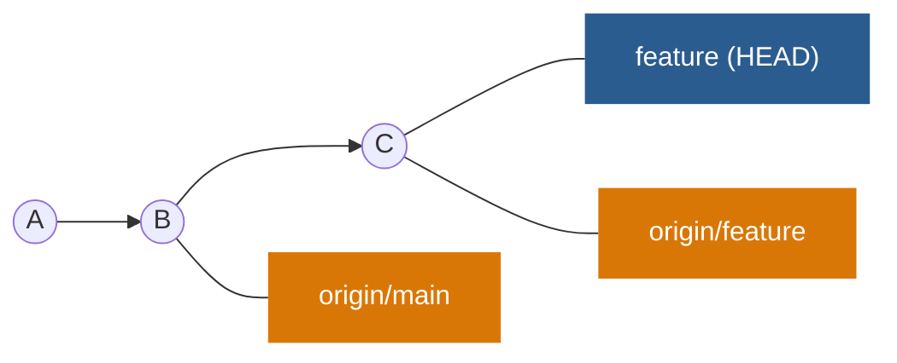

Remote:
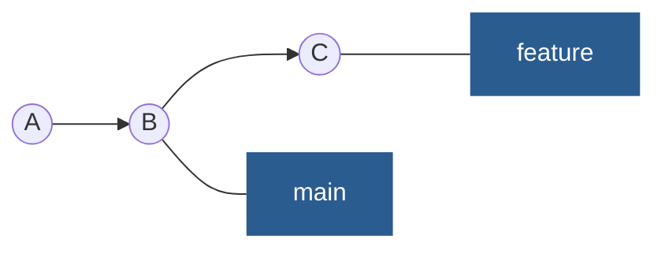


### Tracking Branches

Checking out a local branch from a remote-tracking branch automatically creates what is called a **tracking branch** (and the branch it tracks is called an “upstream branch”). 

Tracking branches are local branches that have a direct relationship to a remote branch. 

If you’re on a tracking branch and type `git pull`, Git automatically knows which server to fetch from and which branch to merge in.

**When you clone a repository, it generally automatically creates a `master` branch that tracks `origin/master`.**


#### How to set up your own tracking branches

Use: `git checkout -b <branch> <remote>/<branch>`

```console
$ git checkout -b sf origin/serverfix
Branch sf set up to track remote branch serverfix from origin.
Switched to a new branch 'sf'
```

Now, your local branch `sf` will automatically pull from `origin/serverfix`.


OR, use `--track`:

```console
$ git checkout --track origin/serverfix
Branch serverfix set up to track remote branch serverfix from origin.
Switched to a new branch 'serverfix'
```

This is so common that there’s even a shortcut for that shortcut. If the branch name you’re trying to checkout (a) doesn’t exist and (b) exactly matches a name on only one remote, Git will create a tracking branch for you:

```console
$ git checkout serverfix
Branch serverfix set up to track remote branch serverfix from origin.
Switched to a new branch 'serverfix'
```

#### Set upstream branch

If you already have a local branch and want to set it to a remote branch you just pulled down, or want to change the upstream branch you’re tracking, you can use the `-u` or `--set-upstream-to` option to `git branch` to explicitly set it at any time.

```console
$ git branch -u origin/serverfix
Branch serverfix set up to track remote branch serverfix from origin.
```

#### See your tracking branches

If you want to see what tracking branches you have set up, you can use the `-vv` option to `git branch`. This will list out your local branches with more information including what each branch is tracking and if your local branch is ahead, behind or both.

```console
$ git branch -vv
  iss53     7e424c3 [origin/iss53: ahead 2] Add forgotten brackets
  master    1ae2a45 [origin/master] Deploy index fix
* serverfix f8674d9 [teamone/server-fix-good: ahead 3, behind 1] This should do it
  testing   5ea463a Try something new
```

`iss53` branch is tracking `origin/iss53` and is “ahead” by two, meaning that we have two commits locally that are not pushed to the server. 

`master` branch is tracking `origin/master` and is up to date. 

`serverfix` branch is tracking the `server-fix-good` branch on our `teamone` server and is ahead by three and behind by one, meaning that there is one commit on the server we haven’t merged in yet and three commits locally that we haven’t pushed. 

`testing` branch is not tracking any remote branch.


**Note:** **This command does not reach out to the servers**, it’s telling you about what it has cached from these servers locally. 

If you want totally up to date ahead and behind numbers, you’ll need to fetch from all your remotes right before running this. You could do that like this:

```console
$ git fetch --all; git branch -vv
```


### Pulling from remotes

-> `git fetch` command will fetch all the changes on the server that you don’t have yet, it will not modify your working directory at all. It will simply get the data for you and let you merge it yourself.

`git pull` is  a `git fetch` immediately followed by a `git merge` in most cases.

-> If you have a tracking branch, either by explicitly setting it or by having it created for you by the `clone` or `checkout` commands, `git pull` will look up what server and branch your current branch is tracking, fetch from that server and then try to merge in that remote branch.

##### Why do we need to merge after a fetch?

Suppose you are on `main` branch. Your remote repo at github also has a main branch. This is your `origin/main` branch on your local machine. You fetch to update `origin/main`:

```bash
$ git fetch origin main
```

But your main branch doesn't change. Suppose the `main` branch at github is ahead by a few commits in the remote server. You want to push your changes, so you do a `git push`. It would get rejected:

Remote:
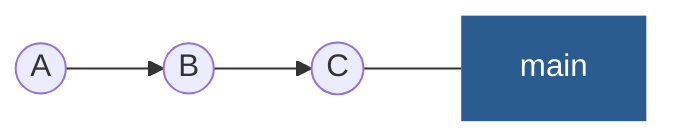

Your machine:
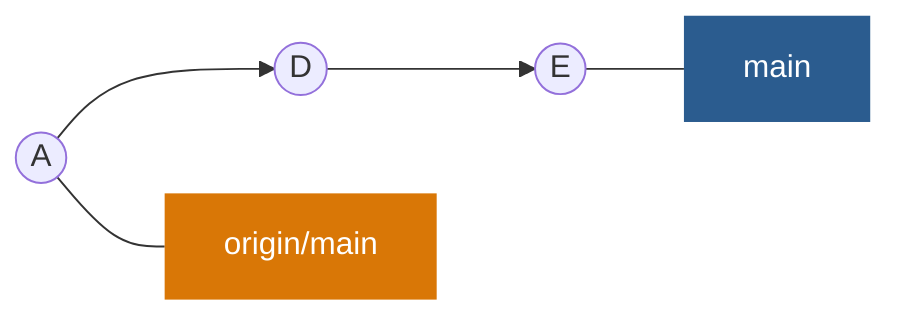

How would `main` at remote server even update? Do you expect it to just make something like `A<-B<-C<-D<-E`? Nope, doesn't work like that.

So, how to push? First, update `origin/main` with a fetch:

Remote:


Your machine:
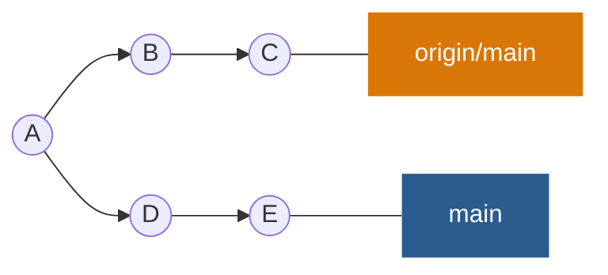


Now, you need to incorporate the changes you made (commits `D` and `E`). How to do that? Do a merge, simple:

Remote:


Your machine:

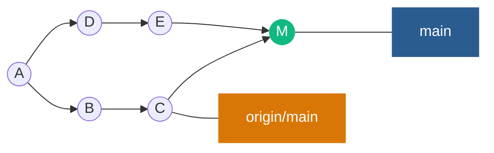

Now you can push:

Remote:
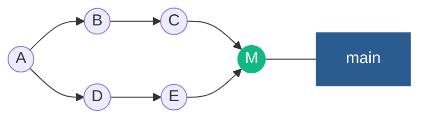

Your machine:


Is there a shortcut for fetch + merge? yep, it's called a pull.


### Deleting Remote Branches

Suppose you’re done with a remote branch, say you and your collaborators are finished with a feature and have merged it into your remote’s `master` branch (or whatever branch your stable codeline is in). 

You can delete a remote branch using the `--delete` option to `git push`. 

If you want to delete your `serverfix` branch from the server, you run the following:

```console
$ git push origin --delete serverfix
To https://github.com/schacon/simplegit
 - [deleted]         serverfix
```

Basically all this does is to remove the pointer from the server. The Git server will generally keep the data there for a while until a garbage collection runs, so if it was accidentally deleted, it’s often easy to recover.