# Ketty API Layer UML

  

This diagram shows how backend controllers expose API endpoints, how they use DTOs, how they delegate to services, and how services talk to repositories.

```mermaid

classDiagram

class AuthController {

+register(request)

+login(request)

}

  

class ProfileController {

+getMyProfile()

+updateMyProfile(request)

+getProfileByUsername(username)

}

  

class PostController {

+createPost(request)

+getAllPosts(username)

+getPersonalPosts(username)

+getPostsByHobby(username, hobbyId)

+updatePost(postId, request)

+deletePost(postId)

+toggleLike(postId)

+addComment(postId, request)

+deleteComment(commentId)

}

  

class HobbyController {

+addHobby(request)

+getMyHobbies()

+getHobbiesByUsername(username)

+deleteHobby(hobbyId)

+addEntry(hobbyId, request)

+updateEntry(hobbyId, entryId, request)

+deleteEntry(hobbyId, entryId)

}

  

class ProjectController {

+createProject(request)

+getProjects(username)

+getProjectsByStatus(username, status)

+updateProject(projectId, request)

+deleteProject(projectId)

}

  

class SearchController {

+searchGames(q)

+searchMusic(q)

+searchBooks(q)

+searchMovies(q)

+searchTv(q)

+searchAnime(q)

}

  

class UploadController {

+uploadImage(file)

+uploadVideo(file)

}

  

class UserService {

+register(RegisterRequest) AuthResponse

+login(LoginRequest) AuthResponse

}

  

class ProfileService {

+getMyProfile(String) ProfileResponse

+getProfileByUsername(String) ProfileResponse

+updateProfile(String, ProfileUpdateRequest) ProfileResponse

}

  

class PostService {

+createPost(String, CreatePostRequest) PostResponse

+getAllPosts(String) List~PostResponse~

+getPersonalPosts(String) List~PostResponse~

+getPostsByHobby(String, Long) List~PostResponse~

+updatePost(String, Long, CreatePostRequest) PostResponse

+deletePost(String, Long)

+toggleLike(String, Long) int

+addComment(String, Long, CreateCommentRequest) CommentResponse

+deleteComment(String, Long)

}

  

class HobbyService {

+addHobby(String, AddHobbyRequest) HobbyResponse

+getHobbies(String) List~HobbyResponse~

+deleteHobby(String, Long)

+addEntry(String, Long, AddHobbyEntryRequest) HobbyEntryResponse

+updateEntry(String, Long, Long, AddHobbyEntryRequest) HobbyEntryResponse

+deleteEntry(String, Long, Long)

}

  

class ProjectService {

+createProject(String, CreateProjectRequest) ProjectResponse

+getProjects(String) List~ProjectResponse~

+getProjectsByStatus(String, ProjectStatus) List~ProjectResponse~

+updateProject(String, Long, UpdateProjectRequest) ProjectResponse

+deleteProject(String, Long)

}

  

class CloudinaryService {

+uploadImage(MultipartFile) String

+uploadVideo(MultipartFile) String

}

  

class RawgSearchService {

+search(String) List~SearchResultItem~

}

  

class LastFmSearchService {

+search(String) List~SearchResultItem~

}

  

class GoogleBooksSearchService {

+search(String) List~SearchResultItem~

}

  

class TmdbSearchService {

+searchMovies(String) List~SearchResultItem~

+searchTv(String) List~SearchResultItem~

}

  

class JikanSearchService {

+search(String) List~SearchResultItem~

}

  

class UserRepository {

+findByUsername(String)

+findByEmail(String)

+existsByUsername(String)

+existsByEmail(String)

}

  

class ProfileLinkRepository {

+findByUser(User)

+deleteByUser(User)

}

  

class PostRepository {

+findByUserOrderByCreatedAtDesc(User)

+findByUserAndHobbyIsNullOrderByCreatedAtDesc(User)

+findByUserAndHobbyOrderByCreatedAtDesc(User, Hobby)

}

  

class CommentRepository {

+findByPostAndParentIsNullOrderByCreatedAtAsc(Post)

+countByPost(Post)

}

  

class LikeRepository {

+existsByUserAndPost(User, Post)

+deleteByUserAndPost(User, Post)

+countByPost(Post)

}

  

class HobbyRepository {

+findByUserOrderByDisplayOrderAsc(User)

+findByUserAndId(User, Long)

+findByUserAndTypeAndName(User, HobbyType, String)

+existsByUserAndTypeAndName(User, HobbyType, String)

+countByUser(User)

}

  

class HobbyEntryRepository {

+findByHobbyOrderByDisplayOrderAsc(Hobby)

+findByHobbyAndId(Hobby, Long)

+existsByHobbyAndExternalId(Hobby, String)

+countByHobby(Hobby)

}

  

class ProjectRepository {

+findByUserOrderByCreatedAtDesc(User)

+findByUserAndStatusOrderByCreatedAtDesc(User, ProjectStatus)

+findByUserAndId(User, Long)

}

  

class ProjectToolRepository {

+findByProject(Project)

+deleteByProject(Project)

}

  

class AuthResponse

class LoginRequest

class RegisterRequest

class ProfileResponse

class ProfileUpdateRequest

class PostResponse

class CreatePostRequest

class CommentResponse

class CreateCommentRequest

class HobbyResponse

class AddHobbyRequest

class HobbyEntryResponse

class AddHobbyEntryRequest

class ProjectResponse

class CreateProjectRequest

class UpdateProjectRequest

class SearchResultItem

  

AuthController --> UserService : uses

ProfileController --> ProfileService : uses

PostController --> PostService : uses

HobbyController --> HobbyService : uses

ProjectController --> ProjectService : uses

SearchController --> RawgSearchService : uses

SearchController --> LastFmSearchService : uses

SearchController --> GoogleBooksSearchService : uses

SearchController --> TmdbSearchService : uses

SearchController --> JikanSearchService : uses

UploadController --> CloudinaryService : uses

  

UserService --> UserRepository : reads/writes

ProfileService --> UserRepository : reads/writes

ProfileService --> ProfileLinkRepository : reads/writes

PostService --> UserRepository : reads/writes

PostService --> PostRepository : reads/writes

PostService --> HobbyRepository : reads/writes

PostService --> LikeRepository : reads/writes

PostService --> CommentRepository : reads/writes

HobbyService --> UserRepository : reads/writes

HobbyService --> HobbyRepository : reads/writes

HobbyService --> HobbyEntryRepository : reads/writes

ProjectService --> UserRepository : reads/writes

ProjectService --> ProjectRepository : reads/writes

ProjectService --> ProjectToolRepository : reads/writes

  

AuthController ..> AuthResponse : returns

AuthController ..> LoginRequest : accepts

AuthController ..> RegisterRequest : accepts

ProfileController ..> ProfileResponse : returns

ProfileController ..> ProfileUpdateRequest : accepts

PostController ..> PostResponse : returns

PostController ..> CreatePostRequest : accepts

PostController ..> CommentResponse : returns

PostController ..> CreateCommentRequest : accepts

HobbyController ..> HobbyResponse : returns

HobbyController ..> AddHobbyRequest : accepts

HobbyController ..> HobbyEntryResponse : returns

HobbyController ..> AddHobbyEntryRequest : accepts

ProjectController ..> ProjectResponse : returns

ProjectController ..> CreateProjectRequest : accepts

ProjectController ..> UpdateProjectRequest : accepts

SearchController ..> SearchResultItem : returns

```

  

  

## Notes

  

- Controllers sit at the API boundary and expose routes.

- DTOs define the request and response shapes.

- Services hold business rules and orchestrate repository calls.

- Repositories are the database access layer.

- Search controllers call external search services rather than repositories.