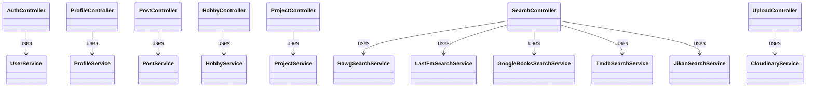
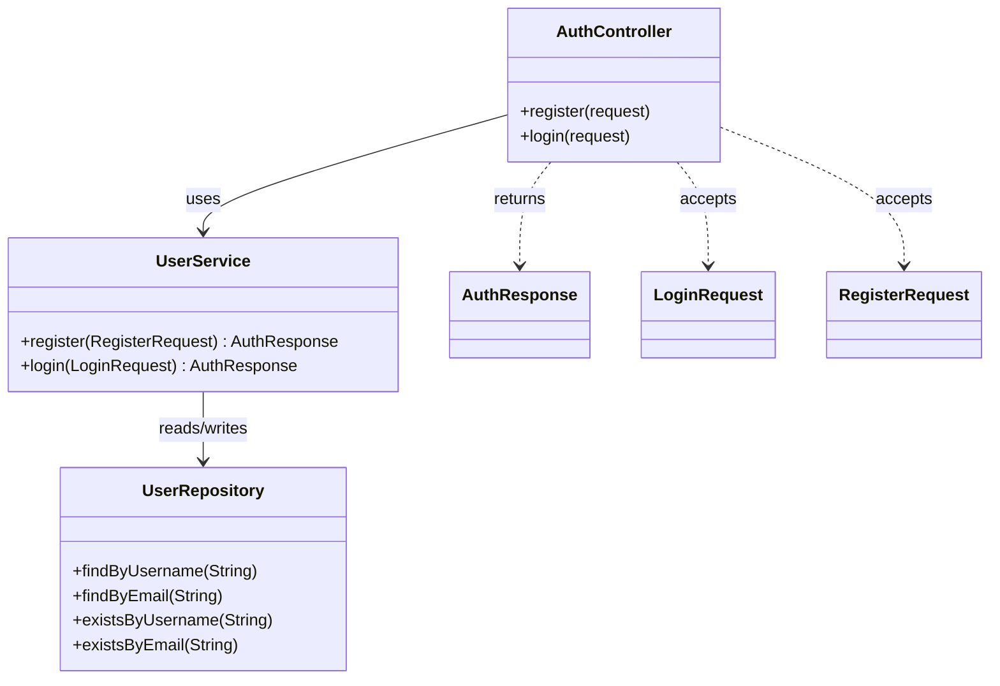
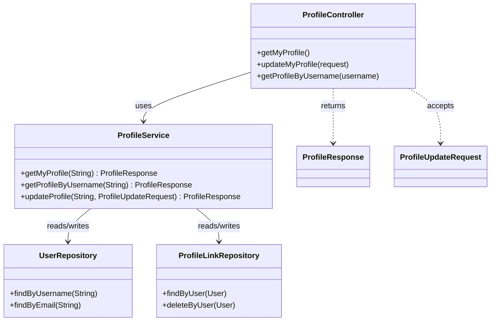
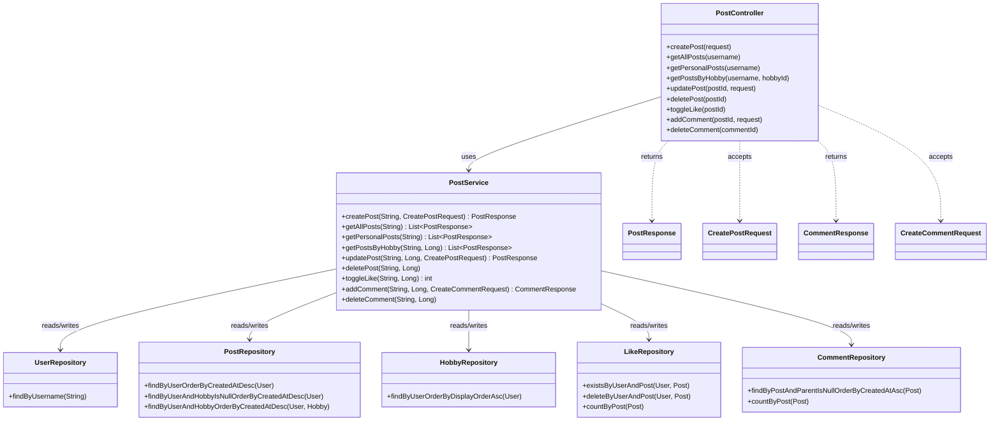
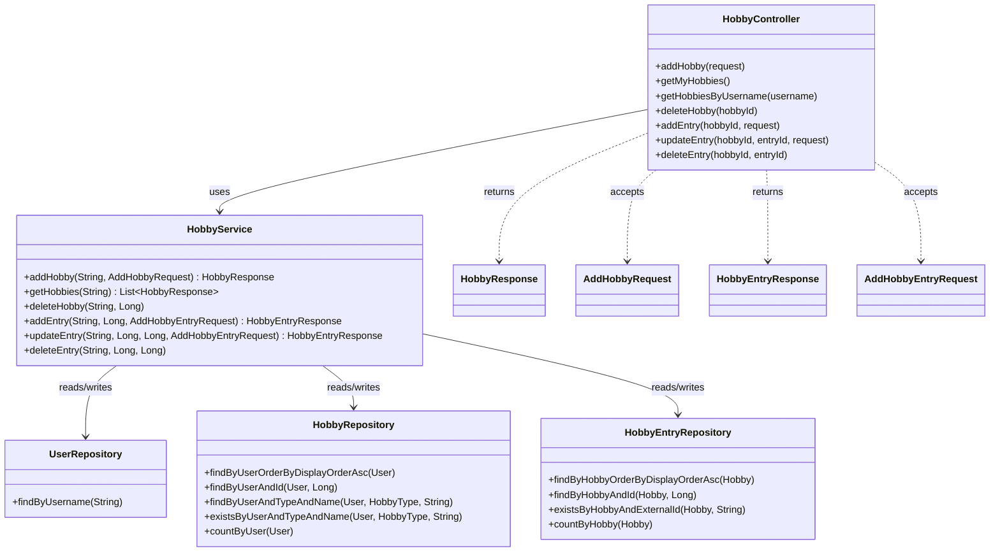
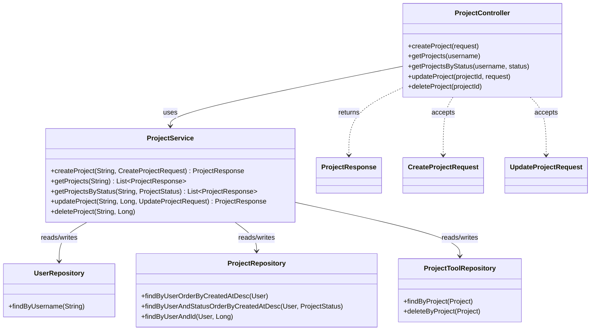
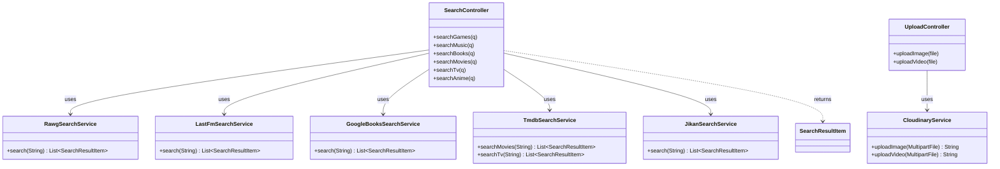

# Ketty API Layer UML (Split View)

The original single diagram was too wide because every controller, service, repository, and DTO sat on one canvas at once. Splitting it by feature domain keeps each diagram narrow and vertical — better for Obsidian's pane width.

## 1. Overview — Controllers to Services

## 2. Auth Domain

## 3. Profile Domain

## 4. Post Domain

## 5. Hobby Domain

## 6. Project Domain

## 7. Search & Upload Domain

## Notes

- Controllers sit at the API boundary and expose routes.
- DTOs define the request and response shapes.
- Services hold business rules and orchestrate repository calls.
- Repositories are the database access layer.
- Search controllers call external search services rather than repositories.
- Some repositories/entities (e.g. `UserRepository`) show up in multiple domain diagrams — that's expected, since multiple features depend on the same core entity.