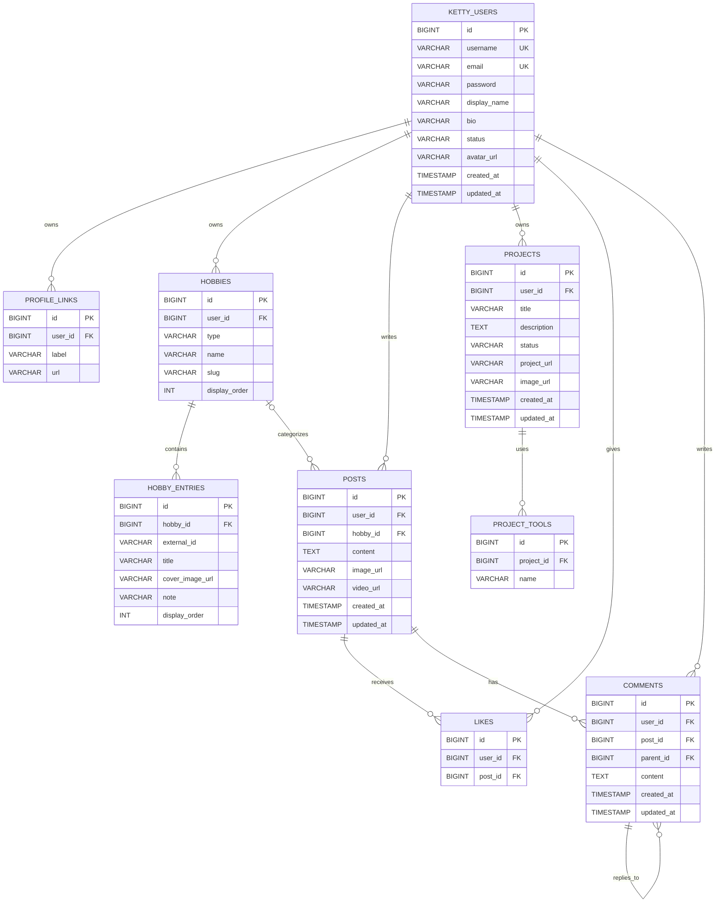

# Ketty ER Diagram

  

This ER diagram represents the backend database model used by the Ketty API.

  

  

## Notes

  

- `PK` means primary key.

- `FK` means foreign key.

- `UK` means unique constraint.

- Unique constraints in schema:

- `HOBBIES`: `(user_id, type, name)`

- `HOBBY_ENTRIES`: `(hobby_id, external_id)`

- `LIKES`: `(user_id, post_id)`

- `COMMENTS.parent_id` creates recursive comment threads (a comment can have replies).

- `POSTS.hobby_id` is optional, so a post can be personal (no hobby) or tied to one hobby.

Credit: Github Copilot