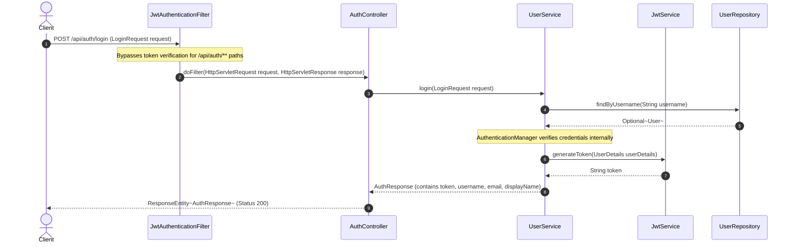
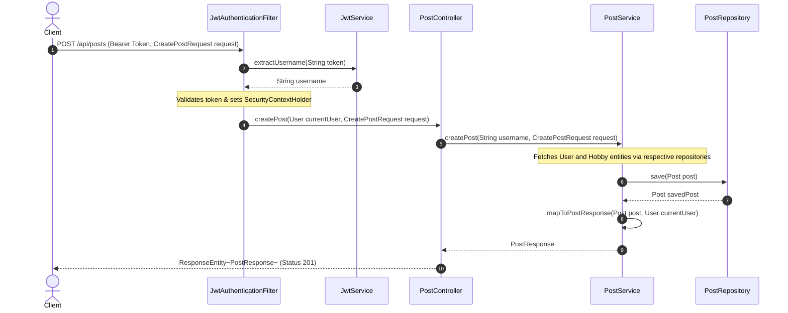
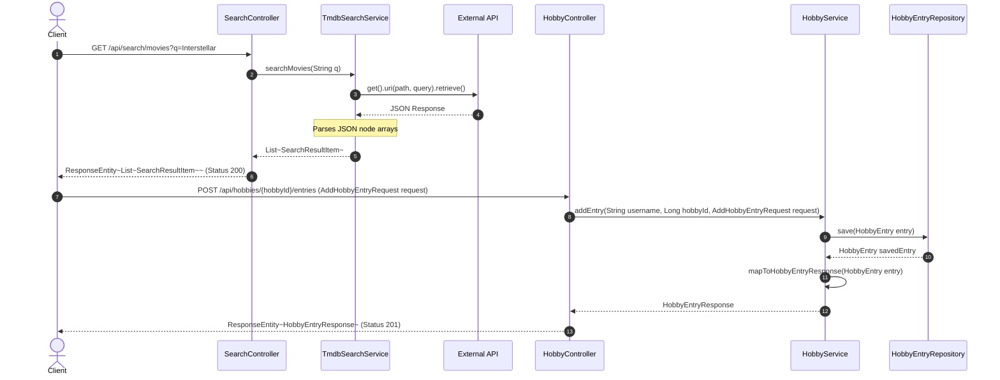

### Part 1: Authentication & Security Filter Chain

### Part 2: Authenticated Content Lifecycle (Posts & Media)

### Part 3: Composite Entity Persistence (Projects & Tools)

```mermaid
sequenceDiagram
    autonumber
    actor Client
    participant ProjCtrl as ProjectController
    participant ProjSvc as ProjectService
    participant ProjRepo as ProjectRepository
    participant ToolRepo as ProjectToolRepository

    Client->>ProjCtrl: POST /api/projects (CreateProjectRequest request)
    ProjCtrl->>ProjSvc: createProject(String username, CreateProjectRequest request)
    Note over ProjSvc: Instantiates Project and sets ProjectStatus
    ProjSvc->>ProjRepo: save(Project project)
    ProjRepo-->>ProjSvc: Project savedProject
    
    rect rgb(30, 30, 30)
        Note over ProjSvc, ToolRepo: Loop execution for request.getTools()
        loop For each String toolName
            ProjSvc->>ToolRepo: save(ProjectTool tool)
        end
    end
    
    ProjSvc->>ProjSvc: mapToProjectResponse(Project project)
    ProjSvc-->>ProjCtrl: ProjectResponse
    ProjCtrl-->>Client: ResponseEntity~ProjectResponse~ (Status 201)
```

### Part 4: Third-Party Search & Hobby Aggregation

