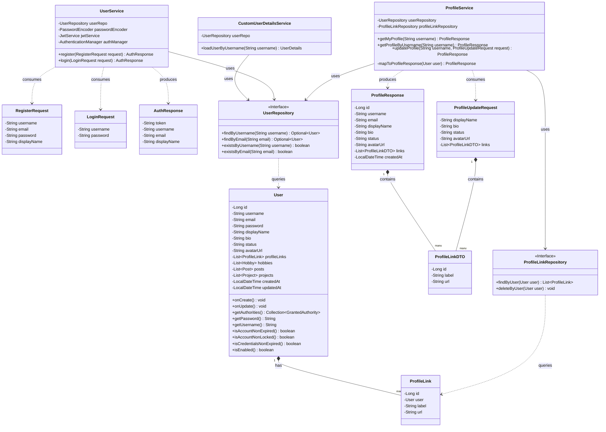
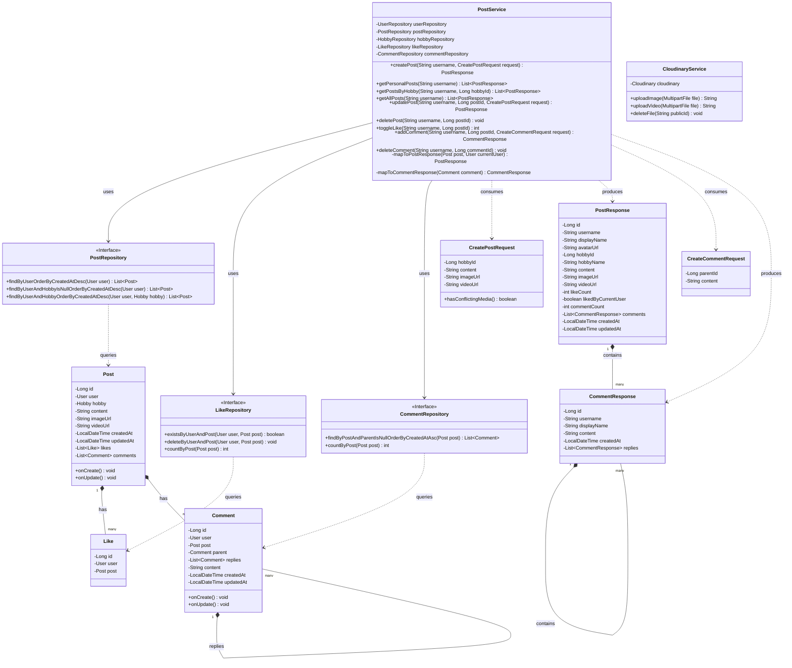
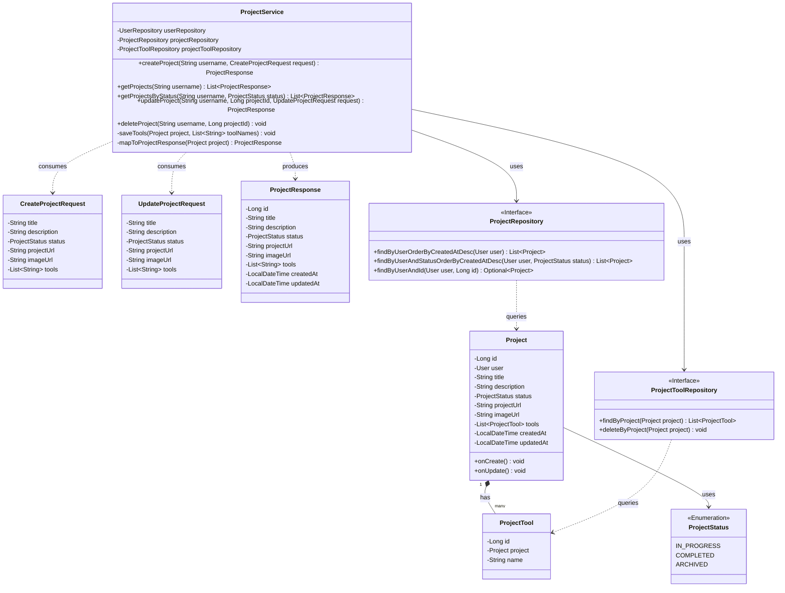
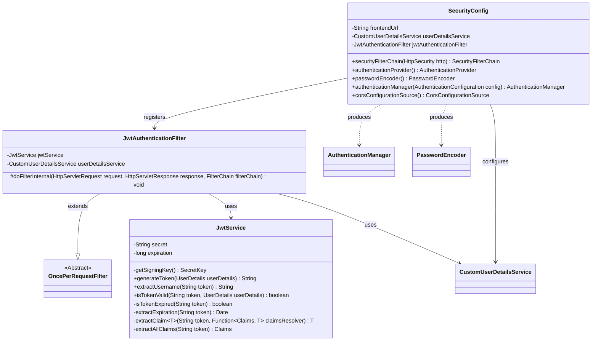

### Part 1: Identity, Authentication & Profile Domain

### Part 2: Social Feeds, Comments & Media Storage

### Part 3: Portfolios & Projects Domain

### Part 4: Hobby Tracking & Third-Party API Catalogs

```mermaid
classDiagram
    direction TB

    class HobbyType {
        <<Enumeration>>
        MUSIC
        GAMES
        BOOKS
        MOVIES
        ANIME
        CUSTOM
    }

    class Hobby {
        -Long id
        -User user
        -HobbyType type
        -String name
        -String slug
        -int displayOrder
        -List~HobbyEntry~ entries
        +onCreate() void
        -generateSlug(String name) String
    }

    class HobbyEntry {
        -Long id
        -Hobby hobby
        -String externalId
        -String title
        -String coverImageUrl
        -String note
        -int displayOrder
    }

    class AddHobbyRequest {
        -HobbyType type
        -String name
    }

    class AddHobbyEntryRequest {
        -String externalId
        -String title
        -String coverImageUrl
        -String note
    }

    class HobbyResponse {
        -Long id
        -HobbyType type
        -String name
        -String slug
        -int displayOrder
        -List~HobbyEntryResponse~ entries
    }

    class HobbyEntryResponse {
        -Long id
        -String externalId
        -String title
        -String coverImageUrl
        -String note
        -int displayOrder
    }

    class SearchResultItem {
        -String externalId
        -String title
        -String coverImageUrl
        -String extraInfo
    }

    class HobbyRepository {
        <<Interface>>
        +findByUserOrderByDisplayOrderAsc(User user) List~Hobby~
        +findByUserAndId(User user, Long id) Optional~Hobby~
        +findByUserAndTypeAndName(User user, HobbyType type, String name) Optional~Hobby~
        +existsByUserAndTypeAndName(User user, HobbyType type, String name) boolean
        +countByUser(User user) int
    }

    class HobbyEntryRepository {
        <<Interface>>
        +findByHobbyOrderByDisplayOrderAsc(Hobby hobby) List~HobbyEntry~
        +findByHobbyAndId(Hobby hobby, Long id) Optional~HobbyEntry~
        +existsByHobbyAndExternalId(Hobby hobby, String externalId) boolean
        +countByHobby(Hobby hobby) int
    }

    class HobbyService {
        -UserRepository userRepository
        -HobbyRepository hobbyRepository
        -HobbyEntryRepository hobbyEntryRepository
        -Map~HobbyType, String~ CATALOGUED_NAMES$
        +addHobby(String username, AddHobbyRequest request) HobbyResponse
        +getHobbies(String username) List~HobbyResponse~
        +deleteHobby(String username, Long hobbyId) void
        +addEntry(String username, Long hobbyId, AddHobbyEntryRequest request) HobbyEntryResponse
        +updateEntry(String username, Long hobbyId, Long entryId, AddHobbyEntryRequest request) HobbyEntryResponse
        +deleteEntry(String username, Long hobbyId, Long entryId) void
        -mapToHobbyResponse(Hobby hobby) HobbyResponse
        -mapToHobbyEntryResponse(HobbyEntry entry) HobbyEntryResponse
    }

    class JikanSearchService {
        -WebClient webClient
        +search(String query) List~SearchResultItem~
    }

    class TmdbSearchService {
        -String apiKey
        -WebClient webClient
        +searchMovies(String query) List~SearchResultItem~
        +searchTv(String query) List~SearchResultItem~
        -search(String query, String path, String dateField, String titleField) List~SearchResultItem~
    }

    class GoogleBooksSearchService {
        -String apiKey
        -WebClient webClient
        +search(String query) List~SearchResultItem~
    }

    class LastFmSearchService {
        -String apiKey
        -WebClient webClient
        +search(String query) List~SearchResultItem~
        -extractLastFmImage(Map track) String
    }

    class RawgSearchService {
        -String apiKey
        -WebClient webClient
        +search(String query) List~SearchResultItem~
    }

    Hobby --> HobbyType : uses
    Hobby "1" *-- "many" HobbyEntry : has
    HobbyRepository ..> Hobby : queries
    HobbyEntryRepository ..> HobbyEntry : queries
    HobbyService --> HobbyRepository : uses
    HobbyService --> HobbyEntryRepository : uses
    HobbyService ..> AddHobbyRequest : consumes
    HobbyService ..> AddHobbyEntryRequest : consumes
    HobbyService ..> HobbyResponse : produces
    HobbyService ..> HobbyEntryResponse : produces
    HobbyResponse "1" *-- "many" HobbyEntryResponse : contains
    JikanSearchService ..> SearchResultItem : creates
    TmdbSearchService ..> SearchResultItem : creates
    GoogleBooksSearchService ..> SearchResultItem : creates
    LastFmSearchService ..> SearchResultItem : creates
    RawgSearchService ..> SearchResultItem : creates
```

### Part 5: API Controllers & Routing Layer

```mermaid
classDiagram
    direction TB

    class AuthController {
        -UserService userService
        +register(RegisterRequest request) ResponseEntity~AuthResponse~
        +login(LoginRequest request) ResponseEntity~AuthResponse~
    }

    class UploadController {
        -CloudinaryService cloudinaryService
        +uploadImage(MultipartFile file) ResponseEntity~Map~String, String~~
        +uploadVideo(MultipartFile file) ResponseEntity~Map~String, String~~
    }

    class ProfileController {
        -ProfileService profileService
        +getMyProfile(User currentUser) ResponseEntity~ProfileResponse~
        +updateMyProfile(User currentUser, ProfileUpdateRequest request) ResponseEntity~ProfileResponse~
        +getProfileByUsername(String username) ResponseEntity~ProfileResponse~
    }

    class ProjectController {
        -ProjectService projectService
        +createProject(User currentUser, CreateProjectRequest request) ResponseEntity~ProjectResponse~
        +getProjects(String username) ResponseEntity~List~ProjectResponse~~
        +getProjectsByStatus(String username, ProjectStatus status) ResponseEntity~List~ProjectResponse~~
        +updateProject(User currentUser, Long projectId, UpdateProjectRequest request) ResponseEntity~ProjectResponse~
        +deleteProject(User currentUser, Long projectId) ResponseEntity~Void~
    }

    class PostController {
        -PostService postService
        +createPost(User currentUser, CreatePostRequest request) ResponseEntity~PostResponse~
        +getAllPosts(String username) ResponseEntity~List~PostResponse~~
        +getPersonalPosts(String username) ResponseEntity~List~PostResponse~~
        +getPostsByHobby(String username, Long hobbyId) ResponseEntity~List~PostResponse~~
        +updatePost(User currentUser, Long postId, CreatePostRequest request) ResponseEntity~PostResponse~
        +deletePost(User currentUser, Long postId) ResponseEntity~Void~
        +toggleLike(User currentUser, Long postId) ResponseEntity~Integer~
        +addComment(User currentUser, Long postId, CreateCommentRequest request) ResponseEntity~CommentResponse~
        +deleteComment(User currentUser, Long commentId) ResponseEntity~Void~
    }

    class HobbyController {
        -HobbyService hobbyService
        +addHobby(User currentUser, AddHobbyRequest request) ResponseEntity~HobbyResponse~
        +getMyHobbies(User currentUser) ResponseEntity~List~HobbyResponse~~
        +getHobbiesByUsername(String username) ResponseEntity~List~HobbyResponse~~
        +deleteHobby(User currentUser, Long hobbyId) ResponseEntity~Void~
        +addEntry(User currentUser, Long hobbyId, AddHobbyEntryRequest request) ResponseEntity~HobbyEntryResponse~
        +updateEntry(User currentUser, Long hobbyId, Long entryId, AddHobbyEntryRequest request) ResponseEntity~HobbyEntryResponse~
        +deleteEntry(User currentUser, Long hobbyId, Long entryId) ResponseEntity~Void~
    }

    class SearchController {
        -RawgSearchService rawgSearchService
        -LastFmSearchService lastFmSearchService
        -GoogleBooksSearchService googleBooksSearchService
        -TmdbSearchService tmdbSearchService
        -JikanSearchService jikanSearchService
        +searchGames(String q) ResponseEntity~List~SearchResultItem~~
        +searchMusic(String q) ResponseEntity~List~SearchResultItem~~
        +searchBooks(String q) ResponseEntity~List~SearchResultItem~~
        +searchMovies(String q) ResponseEntity~List~SearchResultItem~~
        +searchTv(String q) ResponseEntity~List~SearchResultItem~~
        +searchAnime(String q) ResponseEntity~List~SearchResultItem~~
    }

    AuthController --> UserService : uses
    UploadController --> CloudinaryService : uses
    ProfileController --> ProfileService : uses
    ProjectController --> ProjectService : uses
    PostController --> PostService : uses
    HobbyController --> HobbyService : uses
    
    SearchController --> RawgSearchService : uses
    SearchController --> LastFmSearchService : uses
    SearchController --> GoogleBooksSearchService : uses
    SearchController --> TmdbSearchService : uses
    SearchController --> JikanSearchService : uses
```

### Part 6: Security, JWT & Configuration

