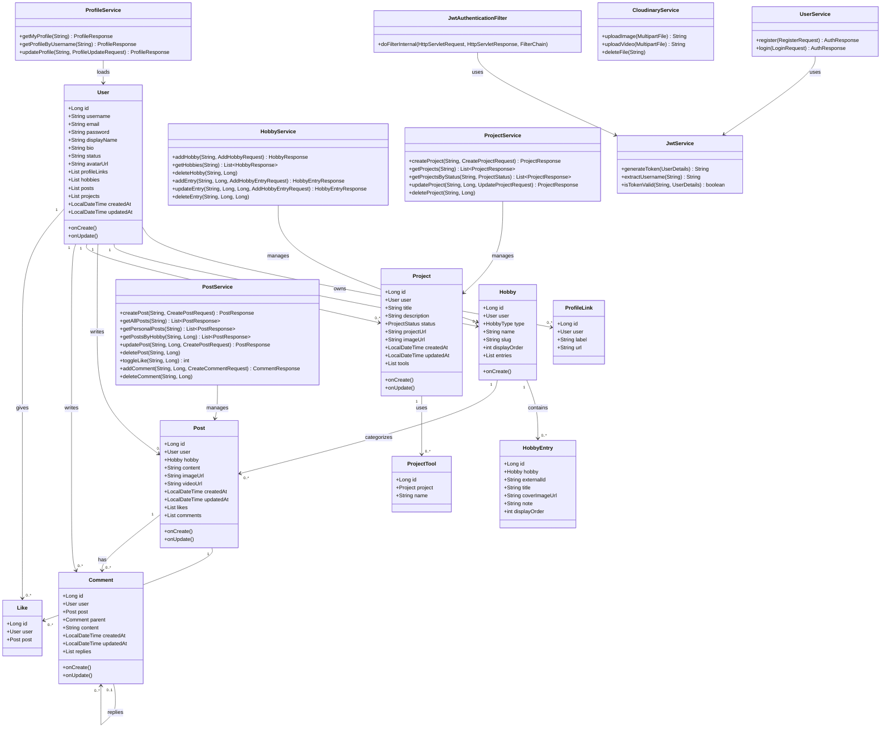
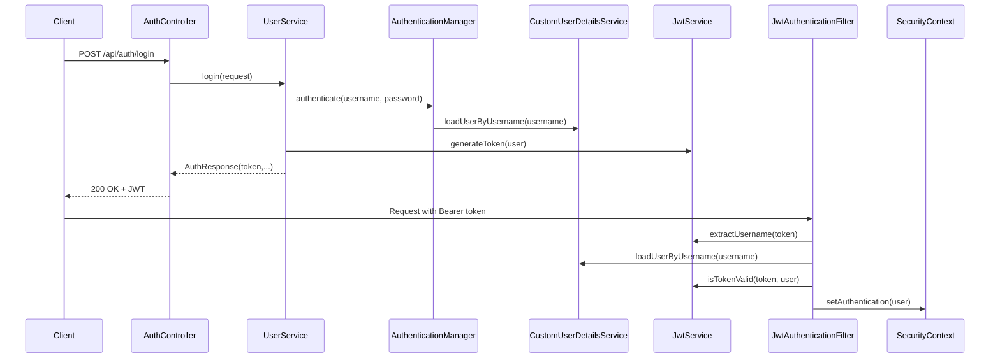

# Ketty Backend UML Diagram

  

This file contains UML views for the backend API.

  

## 1) UML Class Diagram (Domain + Core Services)

  
# Ketty Backend UML Diagram

  

This file contains UML views for the backend API.

  

## 1) UML Class Diagram (Domain + Core Services)

  

  

## 2) UML Sequence Diagram (Authentication)

  

