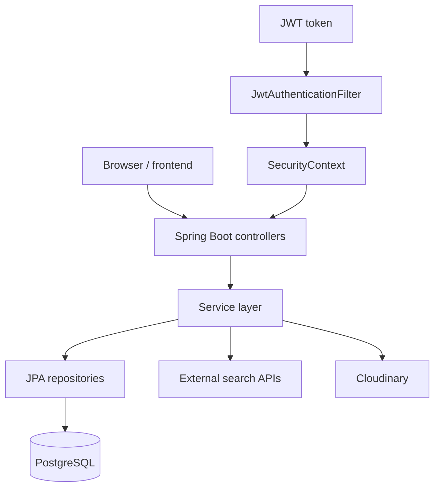
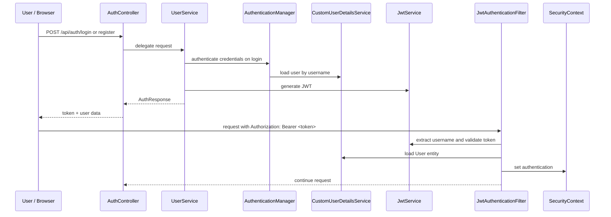
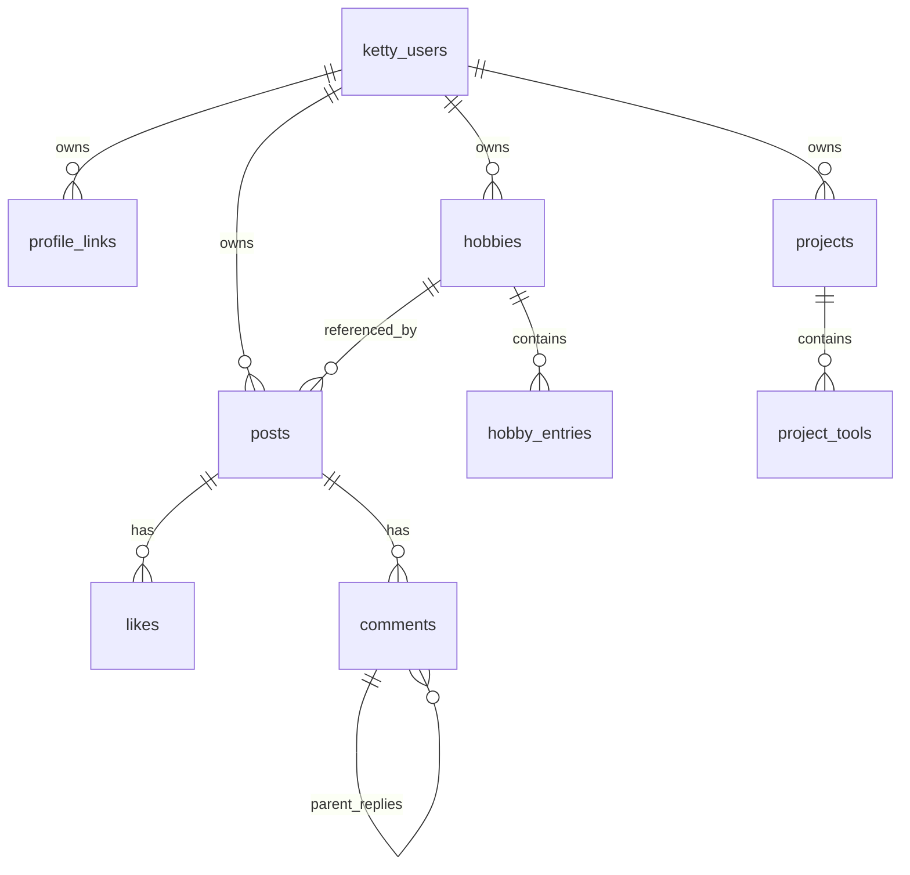
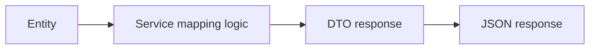
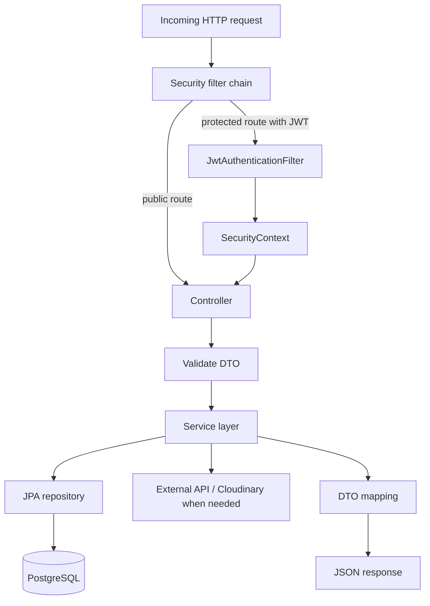

# Ketty Backend Architecture and Concepts

This document explains how the Ketty backend works from the ground up. It focuses only on the Spring Boot API in the `api/` folder: how requests enter the system, how authentication works, how JPA maps objects to tables, how services and repositories cooperate, and how external APIs are called.

  

The goal is practical understanding. If a term is unfamiliar, this document either explains it inline or points out what to look up.

  

## 1. Big Picture

  

Ketty’s backend is a Spring Boot application built around four major ideas:

  

1. HTTP controllers receive requests and return JSON responses.

2. Services contain the business rules.

3. JPA entities describe persistent data and map Java objects to database tables.

4. Spring Security plus JWT protect the private API routes.

  

The backend also does two kinds of outbound work:

  

1. It calls external search APIs such as RAWG, Last.fm, Google Books, TMDb, and Jikan.

2. It uploads media files to Cloudinary.

  

At a high level, the runtime flow looks like this:

  

  

The important idea is that controllers do not talk to the database directly. They call services, and services call repositories or external APIs as needed.

  

---

  

## 2. Backend Project Structure

  

The backend source lives under `api/src/main/java/com/ketty/api/` and is organized into these main packages:

  

- `config/` for security and JWT plumbing

- `controller/` for HTTP endpoints

- `dto/` for request and response payloads

- `entity/` for JPA persistence models

- `exception/` for centralized API error handling

- `repository/` for Spring Data JPA repositories

- `service/` for business logic

- `service/search/` for third-party API search adapters

  

The application is started by [ApiApplication.java](api/src/main/java/com/ketty/api/ApiApplication.java).

  

The backend dependencies are declared in [pom.xml](api/pom.xml). The key ones are:

  

- Spring Web for REST endpoints

- Spring Data JPA for database access

- Spring Security for authentication and authorization

- JWT libraries for token handling

- Validation for request validation

- WebFlux for `WebClient`, which is used to call third-party APIs

- PostgreSQL driver for the database

- Cloudinary SDK for media uploads

  

The runtime configuration is in [application.properties](api/src/main/resources/application.properties). It holds the database URL, JWT secret and expiration, frontend CORS origin, third-party API keys, and Cloudinary credentials.

  

---

  

## 3. Application Startup

  

### [ApiApplication.java](api/src/main/java/com/ketty/api/ApiApplication.java)

  

This is the Spring Boot entry point.

  

Fields:

  

- None

  

Methods:

  

- `main(String[] args)`: starts the Spring application.

  

What it does:

  

- Boots the application context.

- Triggers component scanning.

- Registers controllers, services, repositories, and configuration beans.

  

What to know:

  

- Because the class is in the root package `com.ketty.api`, Spring finds everything under that package automatically.

  

---

  

## 4. Security Architecture

  

Ketty uses stateless authentication. “Stateless” means the server does not keep a login session in memory. Instead, every request carries a JWT token, and the server validates that token each time.

  

### Authentication flow diagram

  

  

### [SecurityConfig.java](api/src/main/java/com/ketty/api/config/SecurityConfig.java)

  

This class configures the security filter chain and cross-origin access.

  

Fields:

  

- `frontendUrl`: the frontend origin loaded from `frontend.url` in properties

- `userDetailsService`: the custom user loader

- `jwtAuthenticationFilter`: the filter that reads and validates JWTs

  

Methods:

  

- `securityFilterChain(HttpSecurity http)`: configures the authorization rules, disables CSRF, enables CORS, makes sessions stateless, registers the JWT filter, and defines which routes are public

- `authenticationProvider()`: creates the `DaoAuthenticationProvider` used for username/password login

- `passwordEncoder()`: returns a `BCryptPasswordEncoder`

- `authenticationManager(AuthenticationConfiguration config)`: exposes Spring’s authentication manager

- `corsConfigurationSource()`: defines allowed frontend origins, headers, methods, and credentials

  

What it means in practice:

  

- `OPTIONS /**` requests are allowed so browsers can do CORS preflight checks.

- `/api/auth/**` is public because users need to register and log in.

- `/api/search/**` is public because search is read-only and used to discover hobby content.

- `GET` requests for posts, profiles, and projects are public.

- Every other route requires authentication.

- The server does not use a login session cookie. Each request is authenticated independently.

  

Important security concepts:

  

- **CORS** means Cross-Origin Resource Sharing. It is the browser safety rule that prevents one origin from freely calling another origin unless the server allows it.

- **CSRF** means Cross-Site Request Forgery. It is usually relevant when cookie-based sessions are used. This app disables CSRF because it uses bearer tokens instead of session cookies.

- **AuthenticationProvider** is Spring Security’s pluggable component that knows how to verify username/password credentials.

  

### [JwtAuthenticationFilter.java](api/src/main/java/com/ketty/api/config/JwtAuthenticationFilter.java)

  

This is a `OncePerRequestFilter`, which means it runs once for every HTTP request.

  

Fields:

  

- `jwtService`: token parser and validator

- `userDetailsService`: user lookup service

  

Methods:

  

- `doFilterInternal(...)`: reads the `Authorization` header, skips auth routes, validates bearer tokens, loads the user, and places authentication into the security context

  

How it works:

  

1. It reads the request header `Authorization`.

2. It immediately skips any path under `/api/auth/` because login and registration do not yet have a token.

3. If there is no `Bearer ` prefix, it lets the request continue without authentication.

4. If a token exists, it extracts the username from the token.

5. It loads the `User` entity through `CustomUserDetailsService`.

6. It asks `JwtService` whether the token is valid for that user.

7. If valid, it creates a `UsernamePasswordAuthenticationToken` and stores it in `SecurityContextHolder`.

  

What the security context is:

  

- The `SecurityContextHolder` is Spring Security’s per-request storage for “who is currently authenticated”.

- Once this is set, controllers can use `@AuthenticationPrincipal` to get the logged-in user.

  

### [JwtService.java](api/src/main/java/com/ketty/api/config/JwtService.java)

  

This service handles token creation and token parsing.

  

Fields:

  

- `secret`: the signing secret from application properties

- `expiration`: token lifetime in milliseconds

  

Methods:

  

- `generateToken(UserDetails userDetails)`: creates a signed JWT whose subject is the username

- `extractUsername(String token)`: returns the token subject

- `isTokenValid(String token, UserDetails userDetails)`: checks username match and expiration

- `isTokenExpired(String token)`: compares expiration with the current time

- `extractExpiration(String token)`: reads the expiration claim

- `extractClaim(String token, Function<Claims, T> claimsResolver)`: generic claim extraction helper

- `extractAllClaims(String token)`: parses and verifies the signed token

- `getSigningKey()`: turns the configured secret into an HMAC signing key

  

What to understand:

  

- A JWT is a signed token. “Signed” means the server can detect tampering.

- The token used here is minimal: it contains the username, issued-at time, and expiration.

- The server does not store JWTs in the database.

- If the signature is invalid or the token is malformed, parsing fails.

  

### [CustomUserDetailsService.java](api/src/main/java/com/ketty/api/service/CustomUserDetailsService.java)

  

This adapts the database user model to Spring Security.

  

Fields:

  

- `userRepo`: the user repository

  

Methods:

  

- `loadUserByUsername(String username)`: loads a user by username and returns it as `UserDetails`

  

Important behavior:

  

- It returns the actual `User` entity, not a separate security DTO.

- That is why the app can later use `@AuthenticationPrincipal User currentUser` directly in controllers.

  

### Security summary

  

The backend’s auth design is:

  

- Register or log in

- Receive JWT + basic user identity

- Store the token in the client

- Send the token on every request

- Reconstruct the authentication on the server from the token

  

There is no refresh-token system, no server-side session store, and no role system in the current code.

  

---

  

## 5. Database and JPA Mapping

  

JPA means Java Persistence API. It is the layer that lets Java objects map to relational database tables.

  

The general pattern in this app is:

  

- Each major business object has a JPA entity.

- The entity maps to a table.

- Relationships are expressed with `@ManyToOne` and `@OneToMany`.

- The service layer converts entities to DTOs before returning them to the client.

  

### Entity-to-table overview

  

  

### Table mapping table

  

| Entity | Table name | Purpose |

| --- | --- | --- |

| User | `ketty_users` | Stores account, profile, and ownership data |

| ProfileLink | `profile_links` | Stores external links for a profile |

| Hobby | `hobbies` | Stores user hobby categories/sections |

| HobbyEntry | `hobby_entries` | Stores items inside a hobby section |

| Post | `posts` | Stores user posts, optional media, and hobby association |

| Comment | `comments` | Stores threaded comments |

| Like | `likes` | Stores user-post likes |

| Project | `projects` | Stores user project cards |

| ProjectTool | `project_tools` | Stores tool names for each project |

  

### Relationship rules

  

- `User` is the root owner of profile links, hobbies, posts, and projects.

- `Post` belongs to one `User` and optionally one `Hobby`.

- `Comment` belongs to one `User`, one `Post`, and optionally one parent `Comment`.

- `Like` belongs to one `User` and one `Post`.

- `Hobby` belongs to one `User` and owns many `HobbyEntry` rows.

- `Project` belongs to one `User` and owns many `ProjectTool` rows.

  

### Cascade and orphan removal

  

Cascade means an operation on the parent can automatically apply to children. Orphan removal means if a child is removed from the parent relationship, JPA can delete it from the database.

  

This code uses those features heavily:

  

- `User` cascades to profile links, hobbies, posts, and projects

- `Hobby` cascades to hobby entries

- `Post` cascades to likes and comments

- `Comment` cascades to replies

- `Project` cascades to project tools

  

This makes parent-driven object graphs easy to manage, but it also means you need to be careful when replacing child collections.

  

### Lazy loading

  

Most `ManyToOne` relationships are `FetchType.LAZY`. Lazy loading means JPA does not fetch the related object immediately. It waits until the code actually asks for it.

  

That is useful because it avoids loading too much data too early. But it also means entity access is safer inside transactions, which is why many service methods are annotated `@Transactional`.

  

---

  

## 6. Entity-by-Entity Breakdown

  

### [User.java](api/src/main/java/com/ketty/api/entity/User.java)

  

Fields:

  

- `id`: primary key

- `username`: unique login name

- `email`: unique email address

- `password`: bcrypt-hashed password

- `displayName`: public display name

- `bio`: profile biography

- `status`: short profile status text

- `avatarUrl`: profile image URL

- `profileLinks`: list of external links

- `hobbies`: list of hobbies owned by the user

- `posts`: list of posts created by the user

- `projects`: list of projects created by the user

- `createdAt`: creation timestamp

- `updatedAt`: last update timestamp

  

Methods:

  

- `onCreate()`: sets creation and update timestamps

- `onUpdate()`: refreshes the update timestamp

- `getAuthorities()`: returns an empty list because the app does not currently use roles

- `getPassword()`: returns the stored password

- `getUsername()`: returns the login username

- `isAccountNonExpired()`: always true

- `isAccountNonLocked()`: always true

- `isCredentialsNonExpired()`: always true

- `isEnabled()`: always true

  

What to understand:

  

- This entity is both a database record and a Spring Security principal.

- The security methods make every account appear active, with no lockout logic yet.

  

### [ProfileLink.java](api/src/main/java/com/ketty/api/entity/ProfileLink.java)

  

Fields:

  

- `id`

- `user`

- `label`

- `url`

  

Purpose:

  

- Stores social links, portfolios, or any external profile URL the user wants to show.

  

### [Hobby.java](api/src/main/java/com/ketty/api/entity/Hobby.java)

  

Fields:

  

- `id`

- `user`

- `type`

- `name`

- `slug`

- `displayOrder`

- `entries`

  

Methods:

  

- `onCreate()`: generates a slug from the hobby name

- `generateSlug(String name)`: lowercases, strips special characters, and replaces spaces with hyphens

  

Important behavior:

  

- The unique constraint on user, type, and name prevents duplicate hobby sections.

- `displayOrder` is used to keep the section order stable in the UI.

  

### [HobbyEntry.java](api/src/main/java/com/ketty/api/entity/HobbyEntry.java)

  

Fields:

  

- `id`

- `hobby`

- `externalId`

- `title`

- `coverImageUrl`

- `note`

- `displayOrder`

  

Purpose:

  

- Stores an item inside a hobby, such as a game, book, song, movie, or anime entry.

  

What `externalId` means:

  

- It is the identifier from the third-party search provider.

- The backend uses it to prevent duplicate imports of the same external item.

  

### [Post.java](api/src/main/java/com/ketty/api/entity/Post.java)

  

Fields:

  

- `id`

- `user`

- `hobby`

- `content`

- `imageUrl`

- `videoUrl`

- `createdAt`

- `updatedAt`

- `likes`

- `comments`

  

Methods:

  

- `onCreate()`: sets creation and update timestamps

- `onUpdate()`: refreshes the update timestamp

  

Purpose:

  

- Stores the social feed content that the profile page renders.

  

### [Comment.java](api/src/main/java/com/ketty/api/entity/Comment.java)

  

Fields:

  

- `id`

- `user`

- `post`

- `parent`

- `replies`

- `content`

- `createdAt`

- `updatedAt`

  

Methods:

  

- `onCreate()`: sets timestamps

- `onUpdate()`: refreshes update timestamp

  

Purpose:

  

- Supports nested threads by allowing comments to reply to other comments.

  

### [Like.java](api/src/main/java/com/ketty/api/entity/Like.java)

  

Fields:

  

- `id`

- `user`

- `post`

  

Purpose:

  

- Represents one user liking one post.

  

Important constraint:

  

- A given user can like a given post only once.

  

### [Project.java](api/src/main/java/com/ketty/api/entity/Project.java)

  

Fields:

  

- `id`

- `user`

- `title`

- `description`

- `status`

- `projectUrl`

- `imageUrl`

- `tools`

- `createdAt`

- `updatedAt`

  

Methods:

  

- `onCreate()`: sets timestamps

- `onUpdate()`: refreshes update timestamp

  

Purpose:

  

- Stores portfolio-style project cards.

  

### [ProjectTool.java](api/src/main/java/com/ketty/api/entity/ProjectTool.java)

  

Fields:

  

- `id`

- `project`

- `name`

  

Purpose:

  

- Stores one tool name for a project, such as React, Spring Boot, or PostgreSQL.

  

### Enum files

  

- [HobbyType.java](api/src/main/java/com/ketty/api/entity/HobbyType.java): defines the allowed hobby categories.

- [ProjectStatus.java](api/src/main/java/com/ketty/api/entity/ProjectStatus.java): defines the project life-cycle states.

  

---

  

## 7. DTO and Response Shape Flow

  

The backend deliberately separates persistent entities from response objects.

  

Why this matters:

  

- It keeps JPA internals away from the API.

- It lets the backend return exactly the shape the frontend wants.

- It avoids accidentally serializing huge lazy-loaded graphs.

  

### Request DTOs

  

- [LoginRequest.java](api/src/main/java/com/ketty/api/dto/LoginRequest.java)

- [RegisterRequest.java](api/src/main/java/com/ketty/api/dto/RegisterRequest.java)

- [CreatePostRequest.java](api/src/main/java/com/ketty/api/dto/CreatePostRequest.java)

- [CreateCommentRequest.java](api/src/main/java/com/ketty/api/dto/CreateCommentRequest.java)

- [CreateProjectRequest.java](api/src/main/java/com/ketty/api/dto/CreateProjectRequest.java)

- [UpdateProjectRequest.java](api/src/main/java/com/ketty/api/dto/UpdateProjectRequest.java)

- [AddHobbyRequest.java](api/src/main/java/com/ketty/api/dto/AddHobbyRequest.java)

- [AddHobbyEntryRequest.java](api/src/main/java/com/ketty/api/dto/AddHobbyEntryRequest.java)

- [ProfileUpdateRequest.java](api/src/main/java/com/ketty/api/dto/ProfileUpdateRequest.java)

  

These often include validation annotations such as `@NotBlank`, `@NotNull`, and `@Size`. Those tell Spring Validation to reject bad input before the service logic runs.

  

### Response DTOs

  

- [AuthResponse.java](api/src/main/java/com/ketty/api/dto/AuthResponse.java)

- [ProfileResponse.java](api/src/main/java/com/ketty/api/dto/ProfileResponse.java)

- [ProfileLinkDTO.java](api/src/main/java/com/ketty/api/dto/ProfileLinkDTO.java)

- [PostResponse.java](api/src/main/java/com/ketty/api/dto/PostResponse.java)

- [CommentResponse.java](api/src/main/java/com/ketty/api/dto/CommentResponse.java)

- [HobbyResponse.java](api/src/main/java/com/ketty/api/dto/HobbyResponse.java)

- [HobbyEntryResponse.java](api/src/main/java/com/ketty/api/dto/HobbyEntryResponse.java)

- [ProjectResponse.java](api/src/main/java/com/ketty/api/dto/ProjectResponse.java)

- [SearchResultItem.java](api/src/main/java/com/ketty/api/dto/SearchResultItem.java)

  

### DTO mapping idea

  

  

The mappings are manual and explicit. That is why the service layer has methods like `mapToProfileResponse`, `mapToPostResponse`, `mapToHobbyResponse`, and `mapToProjectResponse`.

  

---

  

## 8. Endpoint Reference

  

This section lists the backend endpoints and the service path behind each one.

  

### Authentication

  

| Method | Endpoint | Purpose | Service path |

| --- | --- | --- | --- |

| POST | `/api/auth/register` | Create a new account | `AuthController -> UserService.register` |

| POST | `/api/auth/login` | Authenticate and return a JWT | `AuthController -> UserService.login` |

  

### Profile

  

| Method | Endpoint | Purpose | Service path |

| --- | --- | --- | --- |

| GET | `/api/profile/me` | Get the authenticated user’s profile | `ProfileController -> ProfileService.getMyProfile` |

| PUT | `/api/profile/me` | Update the authenticated user’s profile | `ProfileController -> ProfileService.updateProfile` |

| GET | `/api/profile/{username}` | Get a public profile by username | `ProfileController -> ProfileService.getProfileByUsername` |

  

### Posts

  

| Method | Endpoint | Purpose | Service path |

| --- | --- | --- | --- |

| POST | `/api/posts` | Create a post | `PostController -> PostService.createPost` |

| GET | `/api/posts/user/{username}` | Get all posts for a user | `PostController -> PostService.getAllPosts` |

| GET | `/api/posts/user/{username}/personal` | Get personal posts only | `PostController -> PostService.getPersonalPosts` |

| GET | `/api/posts/user/{username}/hobby/{hobbyId}` | Get posts for one hobby | `PostController -> PostService.getPostsByHobby` |

| PUT | `/api/posts/{postId}` | Edit a post | `PostController -> PostService.updatePost` |

| DELETE | `/api/posts/{postId}` | Delete a post | `PostController -> PostService.deletePost` |

| POST | `/api/posts/{postId}/like` | Toggle like state | `PostController -> PostService.toggleLike` |

| POST | `/api/posts/{postId}/comments` | Add a comment or reply | `PostController -> PostService.addComment` |

| DELETE | `/api/posts/comments/{commentId}` | Delete one of the user’s comments | `PostController -> PostService.deleteComment` |

  

### Hobbies

  

| Method | Endpoint | Purpose | Service path |

| --- | --- | --- | --- |

| POST | `/api/hobbies` | Create a hobby section | `HobbyController -> HobbyService.addHobby` |

| GET | `/api/hobbies` | Get current user hobbies | `HobbyController -> HobbyService.getHobbies` |

| GET | `/api/hobbies/user/{username}` | Get any user’s hobbies | `HobbyController -> HobbyService.getHobbies` |

| DELETE | `/api/hobbies/{hobbyId}` | Delete one hobby section | `HobbyController -> HobbyService.deleteHobby` |

| POST | `/api/hobbies/{hobbyId}/entries` | Add an item to a hobby | `HobbyController -> HobbyService.addEntry` |

| PUT | `/api/hobbies/{hobbyId}/entries/{entryId}` | Update a hobby entry | `HobbyController -> HobbyService.updateEntry` |

| DELETE | `/api/hobbies/{hobbyId}/entries/{entryId}` | Delete a hobby entry | `HobbyController -> HobbyService.deleteEntry` |

  

### Projects

  

| Method | Endpoint | Purpose | Service path |

| --- | --- | --- | --- |

| POST | `/api/projects` | Create a project | `ProjectController -> ProjectService.createProject` |

| GET | `/api/projects/user/{username}` | Get all user projects | `ProjectController -> ProjectService.getProjects` |

| GET | `/api/projects/user/{username}/status/{status}` | Get projects filtered by status | `ProjectController -> ProjectService.getProjectsByStatus` |

| PUT | `/api/projects/{projectId}` | Edit a project | `ProjectController -> ProjectService.updateProject` |

| DELETE | `/api/projects/{projectId}` | Delete a project | `ProjectController -> ProjectService.deleteProject` |

  

### Search

  

| Method | Endpoint | External provider |

| --- | --- | --- |

| GET | `/api/search/games?q=...` | RAWG |

| GET | `/api/search/music?q=...` | Last.fm |

| GET | `/api/search/books?q=...` | Google Books |

| GET | `/api/search/movies?q=...` | TMDb |

| GET | `/api/search/tv?q=...` | TMDb |

| GET | `/api/search/anime?q=...` | Jikan |

  

### Upload

  

| Method | Endpoint | Purpose |

| --- | --- | --- |

| POST | `/api/upload/image` | Upload an image to Cloudinary |

| POST | `/api/upload/video` | Upload a video to Cloudinary |

  

---

  

## 9. Service Workflows in Detail

  

### 9.1 Registration flow

  

1. The client sends `username`, `email`, `password`, and optional `displayName`.

2. `UserService.register` checks whether username or email already exist.

3. The password is hashed using BCrypt.

4. A new `User` entity is created and persisted.

5. `JwtService.generateToken` signs a token for the new user.

6. The service returns `AuthResponse` with token and basic identity data.

  

Why hashing matters:

  

- The database never stores the raw password.

- BCrypt is a password-hashing algorithm designed to be computationally expensive, which helps defend against brute-force attacks.

  

### 9.2 Login flow

  

1. The client sends username and password.

2. `AuthenticationManager.authenticate(...)` verifies the credentials.

3. Spring Security uses `DaoAuthenticationProvider` and `CustomUserDetailsService` to load the user.

4. BCrypt compares the submitted password against the stored hash.

5. If the credentials are correct, `UserService.login` generates a fresh JWT.

6. The service returns `AuthResponse`.

  

### 9.3 Profile flow

  

`ProfileService` is responsible for reading and updating profile information.

  

`getMyProfile` and `getProfileByUsername` both load a `User` by username and map it into `ProfileResponse`.

  

`updateProfile` works like a partial patch:

  

- If a field is non-null, it is updated.

- If links are supplied, the service deletes all old links and inserts the new set.

- The user is saved.

- The refreshed profile DTO is returned.

  

This “replace the full child collection” strategy is simple and predictable, though it means links are not diffed one by one.

  

### 9.4 Post flow

  

Creating a post involves several checks:

  

1. Resolve the current user.

2. Optionally resolve a hobby by id, but only if the hobby belongs to the same user.

3. Reject the request if both imageUrl and videoUrl are present, because a post cannot contain both at once.

4. Build and save the `Post` entity.

5. Convert it to `PostResponse`.

  

Reading posts:

  

- `getAllPosts` returns all posts for a user.

- `getPersonalPosts` returns posts whose hobby is null.

- `getPostsByHobby` returns posts under one hobby.

  

Updating and deleting posts:

  

- The service loads the post and compares owner ids.

- If the current user is not the owner, it throws a runtime exception.

  

Likes:

  

- If the like row exists, it is deleted.

- Otherwise, a new like row is inserted.

- The new total like count is returned.

  

Comments:

  

- A top-level comment has no parent.

- A reply has a parent comment id.

- When replying, the service verifies that the parent comment belongs to the same post.

- The response is mapped into a recursive tree format.

  

### 9.5 Hobby flow

  

The hobby system is the app’s “section” model.

  

1. `HobbyService.addHobby` determines the correct display name.

2. Standard hobby types use predefined catalogued names.

3. CUSTOM hobbies must supply a name.

4. The service checks for duplicates per user, type, and name.

5. It assigns display order based on how many hobbies the user already has.

6. It saves the hobby.

  

Entries work the same way:

  

- Duplicate items are rejected when they have the same `externalId` inside one hobby.

- `displayOrder` preserves visual ordering.

- Updates patch fields individually.

- Deleting an entry removes just that child row.

  

### 9.6 Project flow

  

Project management is similar to hobbies, but with different fields.

  

1. `ProjectService.createProject` creates the project root row.

2. It then saves child `ProjectTool` rows.

3. Reads return projects in newest-first order.

4. Updates patch scalar fields and replace the tool list if a new list is provided.

5. Deletes remove the owned project.

  

Tools are stored as separate rows so they can be modeled like a child collection rather than a comma-separated string.

  

---

  

## 10. External API Integration

  

### How external calls are made

  

The search services all use `WebClient`. `WebClient` is Spring’s non-blocking HTTP client. In this code, the services call `.block()`, so the result is ultimately waited on synchronously.

  

General external API pattern:

  

1. Read the API key from properties if needed.

2. Build a request with `WebClient.create(baseUrl)`.

3. Add query parameters.

4. Call `.retrieve().bodyToMono(Map.class).block()`.

5. Read the returned map structure.

6. Convert the provider-specific result into `SearchResultItem`.

  

### RAWG

  

File: [RawgSearchService.java](api/src/main/java/com/ketty/api/service/search/RawgSearchService.java)

  

Use:

  

- Searches games.

  

Behavior:

  

- Calls `/games` with the search query.

- Limits to 10 results.

- Returns id, game name, background image, and release year.

  

### Last.fm

  

File: [LastFmSearchService.java](api/src/main/java/com/ketty/api/service/search/LastFmSearchService.java)

  

Use:

  

- Searches music tracks.

  

Behavior:

  

- Calls `track.search`.

- Reads nested `results -> trackmatches -> track` data.

- Extracts the best available image from the image list.

- Uses mbid as the external id when available.

  

### Google Books

  

File: [GoogleBooksSearchService.java](api/src/main/java/com/ketty/api/service/search/GoogleBooksSearchService.java)

  

Use:

  

- Searches books.

  

Behavior:

  

- Calls `/volumes`.

- Extracts title, first author, and thumbnail when available.

  

### TMDb

  

File: [TmdbSearchService.java](api/src/main/java/com/ketty/api/service/search/TmdbSearchService.java)

  

Use:

  

- Searches movies and TV shows.

  

Behavior:

  

- `searchMovies` uses `/search/movie`.

- `searchTv` uses `/search/tv`.

- Both use a shared private search helper.

- The helper extracts title/name, poster image, and release year.

  

### Jikan

  

File: [JikanSearchService.java](api/src/main/java/com/ketty/api/service/search/JikanSearchService.java)

  

Use:

  

- Searches anime.

  

Behavior:

  

- Calls `/anime`.

- Reads poster image from the nested `images.jpg.image_url` structure.

- Uses the episode count as extra info when available.

  

### Why these services exist

  

- The frontend needs a single normalized response shape.

- The backend shields the frontend from provider-specific API weirdness.

- If a provider changes its field names, only one service needs to be updated.

  

---

  

## 11. Cloudinary Upload Flow

  

File: [CloudinaryService.java](api/src/main/java/com/ketty/api/service/CloudinaryService.java)

  

Cloudinary is a media hosting service.

  

Fields:

  

- `cloudinary`: the configured Cloudinary client

  

Methods:

  

- `uploadImage(MultipartFile file)`: uploads bytes into `ketty/images` and returns the secure URL

- `uploadVideo(MultipartFile file)`: uploads bytes into `ketty/videos` as a video resource and returns the secure URL

- `deleteFile(String publicId)`: deletes a Cloudinary asset by public id

  

How it fits into the app:

  

- The frontend uploads a file first.

- Cloudinary stores the media.

- The backend returns a URL.

- That URL is later stored in a post or profile field.

  

This pattern keeps binary file storage out of PostgreSQL.

  

---

  

## 12. Error Handling and Validation

  

### Validation

  

Request DTOs use bean validation annotations such as:

  

- `@NotBlank`

- `@NotNull`

- `@Size`

  

If validation fails, Spring throws `MethodArgumentNotValidException`, and the global exception handler turns it into a 400 response with field-specific messages.

  

### Global errors

  

The backend uses [GlobalExceptionHandler.java](api/src/main/java/com/ketty/api/exception/GlobalExceptionHandler.java) to convert exceptions into predictable JSON responses.

  

Behavior:

  

- Validation errors -> 400 + field map

- Bad credentials -> 401 + `Invalid username or password`

- Runtime exceptions -> 409 + exception message

- Unknown exceptions -> 500 + `Something went wrong`

  

This is why the frontend can often display a simple string or field map without knowing backend stack traces.

  

---

  

## 13. How the Frontend Talks to the Backend, from the Backend’s Perspective

  

Even though this document is backend-only, it helps to understand the incoming request pattern.

  

The browser usually does this:

  

1. Read auth state from localStorage.

2. Send requests through axios.

3. Include the JWT automatically.

4. Call public endpoints for search and public reads.

5. Call protected endpoints for writes and self-profile actions.

  

The backend then does this:

  

1. Security filter validates or ignores the token.

2. Controller receives the request.

3. Service applies business rules.

4. Repository reads or writes the database.

5. Response DTO is returned.

  

That division is important because it shows where each responsibility lives.

  

---

  

## 14. Concept Glossary

  

Here are some terms that may be unfamiliar:

  

- **DTO**: Data Transfer Object. A plain object used to move data across layers or over the network. Look up “DTO pattern” if you want the broader design idea.

- **JPA**: Java Persistence API. The Java standard for object-relational mapping. Look up “ORM” if that term is new too.

- **ORM**: Object-Relational Mapping. A way to map Java objects to database tables and rows.

- **Lazy loading**: delay fetching related data until it is actually accessed.

- **Cascade**: automatically apply persistence operations from parent to child.

- **Orphan removal**: delete a child row when it is no longer referenced by the parent.

- **Bearer token**: a token that proves the client is authenticated; whoever holds it can “bear” it to access the API.

- **JWT**: JSON Web Token. A signed token format used for stateless authentication.

- **Security context**: Spring Security’s storage for the current authenticated principal.

- **Principal**: the current authenticated user identity.

- **WebClient**: Spring’s HTTP client for outbound API requests.

  

---

  

## 15. End-to-End Backend Flow Summary

  

  

What this means in plain language:

  

- Requests come in over HTTP.

- Security decides whether the request is allowed to proceed.

- If the request is private and has a valid JWT, the user is attached to the request.

- The controller delegates to the service.

- The service reads or writes data through repositories.

- Some services call outside systems like Cloudinary or search providers.

- The service converts the result into DTOs.

- The controller sends JSON back to the client.

  

---

  

## 16. What to Remember First

  

If you only remember a few things about the backend, remember these:

  

1. `User` is the anchor entity and also the security principal.

2. JWT is the only auth mechanism.

3. Controllers are thin; services contain the real rules.

4. JPA entities own their children using cascade and orphan removal.

5. Search and upload are the only major external I/O paths.

6. The backend returns DTOs, not entities.

  

That is the core mental model for understanding the whole API.