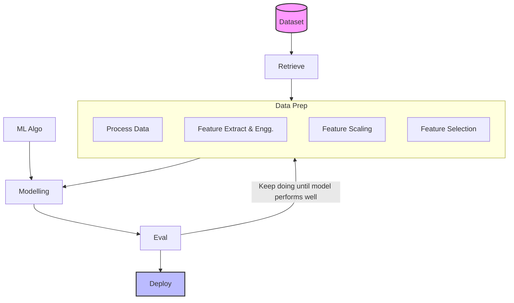

Using domain knowledge to extact features from raw data. These features are used to improve performance of ML model.

### Feature transformation

- Missing values imputation (handling missing values)
- Handling categorical values
- Outlier detection
- Feature scaling

### Feature construction

- Create new features
- Splitting columns

### Feature selection

Select specific features

### Feature extraction

Extract new features programmatically

